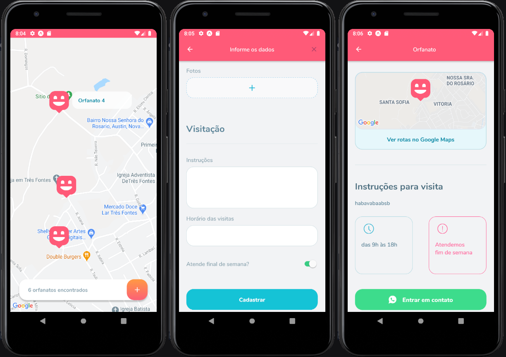

<h1 align="center">Happy - mobile</h1>

<p align="center">
  

  <a href="https://www.linkedin.com/in/helitonoliveira/">
    
  </a>

  

  <a href="https://github.com/heliton1988/happy-mobile/stargazers">
    
  </a>
</p>

<p align="center">
  <a href="#rocket-sobre">Sobre</a>&nbsp;&nbsp;&nbsp;|&nbsp;&nbsp;&nbsp;
  <a href="#wrench-ferramentas-utilizadas">Ferramentas utilizadas</a>&nbsp;&nbsp;&nbsp;|&nbsp;&nbsp;&nbsp;
  <a href="#arrowdown-como-clonar-o-projeto">Baixe o projeto</a>&nbsp;&nbsp;&nbsp;|&nbsp;&nbsp;&nbsp;
  <a href="#pagefacingup-licença">Licença</a>
</p>

<p>
  
</p>

<p>
  
</p>


<br />

Repositório com a versão web:
[Click em mim](https://github.com/heliton1988/happy) :rewind:

## :memo: Sobre

O Happy é uma aplicação que desenvolvi durante os workshops da NLW(Next Level week), treinamento imersivo nas tecnologias React, React Native e seus ecossistema  oferecido pela Rocketseat, com duração de uma semana. ATé o final do treinamente desenvolvido uma aplicação completa que envolve front-end web, mobile & back-end.

O nome happy não foi escolhido por acaso, pois outubro é o mês das crianças, então em homenagem a isso essa aplicação tem uma pegada social com foco nos pequeninos.


## Milha extra

No ultimo dia do evento citado acima, foi proposto uma série de desafio com a finalidade de levar as aplicações para o próximo nível, no mobile foram os seguintes:

`todos que estão com um checked, já foram implementado por mim, os de mais estão em desenvolvimento...`

- ✅ Splash Screen
- ✅ Onboard do usuário
- ✅ Real Time da localização do usuário
- 🚫 Cadastro em múltiplas etapas
- 🚫 Gerar APK

Com o intúito de me desafiar fui além do proposto no treinamento e também nos desafios e resolvi adicionar as seguinte funcionalidades na aplicação:

♠ Loading com animação<br />
♠ Palheta de cores totalmente diferenciada<br />
♠ Alteração em relação ao layout original<br />
♠ Botões customizados com eveito gradiente<br />
♠ StatusBar customizadas para determinadas telas<br />

## :wrench: Ferramentas utilizadas

- [Expo](https://docs.expo.io/)
- [React Native](https://reactnative.dev/)
- [React Nativagion](https://reactnavigation.org/docs/hello-react-navigation/)
- [React Native Maps](https://docs.expo.io/versions/latest/sdk/map-view/)
- [Image-picker](https://docs.expo.io/tutorial/image-picker/#installing-expo-image-picker)
- [Axios](https://github.com/axios/axios)
- [ESlint](https://eslint.org/)
- [EditorConfig](https://editorconfig.org/)

## :arrow_down: Como baixar o projeto

**Observação**: é preciso ter instalado e configurando um emulador como o [Android Studio](https://developer.android.com/studio) em sua maquina.<br />

caso tenha dificuldade em configurar seu ambiente de desenvolvimento com o emulador, siga o passo a passo descrito neste tutorial: [Clique Aqui!](https://react-native.rocketseat.dev/android/emulador) <br />

`antes de rodar o projeto, abra o emulador` <br />
**rode o projeto**<br />

```bash
# clone o projeto
$ git clone https://github.com/heliton1988/happy-mobile.git

# estando na pasta mobile, rode o comando
$ yarn start

# rode o projeto no emulador
$ yarn android
```

<br />

## :page_facing_up: Licença

Esse projeto está sob a licença MIT. Veja o arquivo [LICENSE](https://github.com/heliton1988/happy-mobile/blob/main/LICENSE) para mais detalhes.<br /><br /><br />

<p align="center">Feito com 💛 by <a href="https://www.linkedin.com/in/helitonoliveira/" target="_blank">Héliton Oliveira</a></p>
